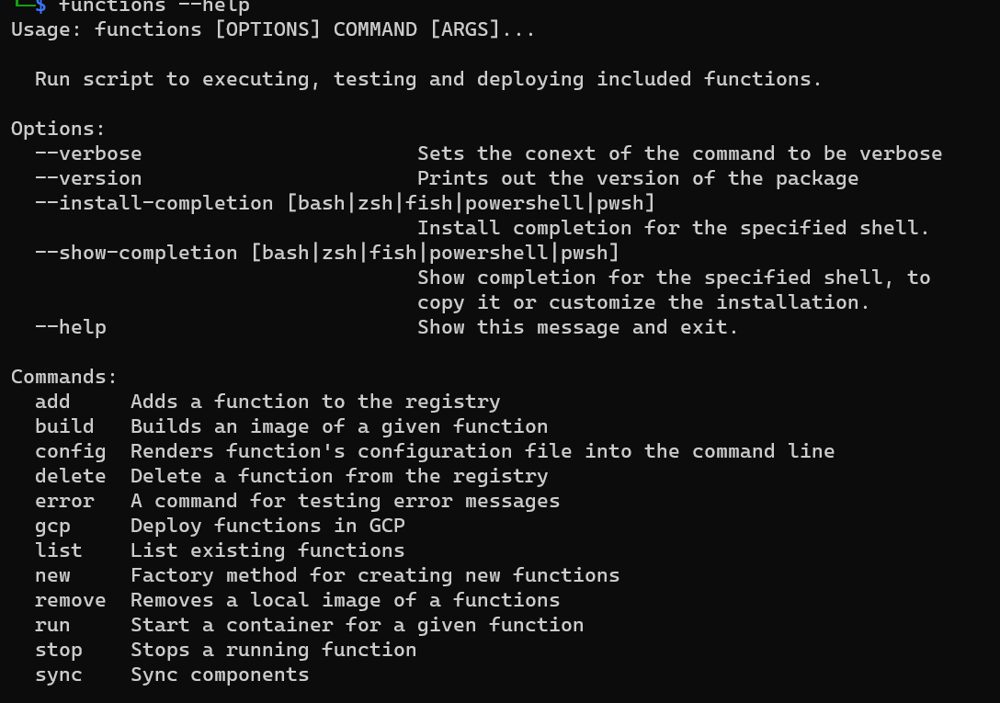

# Initial `functions` setup

* Status: Proposed
* Deciders: [Piotr] <!-- optional -->
* Date: 2021-12-23

## Context and Problem Statement

This document talks briefly about how the project was structured prior to making structured decisions and [documentations records](../adrs).

`functions` was initial built on top of the `typer` library to easily support CLI components.

Repository had a a single subfolder (`commands`) initially that stored scripts specific to each subcommand. Later on a few other folders were added:

* `config` - stored logic around the configuration of the package. That would include the `ventress-functions` folder where all package specific information would be stored. It would also include the logic on how to open and validate these files.
* `docker` - stored logic around managing `docker` component throughout the app. A wrapper of the `docker-py` library with a few addition an interface prepared for making more changes.
* `gcp` - stored logic for interfacing with a

Every other piece of logic was small enough to be kept as a single script at the root of the main `functions` folder.

The code wasn't necessarily clearly contained within a container like the `config` folder. Some of the code would be incorrectly stored into single scripts. There wasn't a clear enough separation of interest, which often lead to refactoring and therefore triggered an attempt of planning and structuring code prior to making any commits.

## List of components

* [`function registry`](../proposals/function_registry.md)
* `docker`
* `cloud` (GCP, AWS, ...)

## CLI context

Here is a view from the command line at this time.

Here is some additional context on these root commands:

* `add` - adds an existing directory to the scope of the package.
* `build` - builds a `docker` image of a function. Is required for running function's locally.
* `config` - meant to enable interaction with config file to display and edit basic configurations (not working)
* `delete` - meant to do several things, delete an image of a function and remove it from the registry, but it was not clear what to do with other items tied to a registry resource.
* `error` - a test command to trigger error validations (should not be visible).
* `gcp` - command only to be used a parent commands storing GCP related commands
* `list` - meant to display all the information about functions registered in the project. Source of truth is the registry file in the `config` directory.
* `new` - another nested command that holds commands to create new functions
* `remove` - meant to remove a function's image as well as make sure that it is no longer present in the reported statuses
* `run` - meant to trigger a start of a function's container and update the status accordingly
* `stop` - meant to stop a running container and update the status accordingly
* `sync` - meant to provide an interface for synchronizing components between different sources. Had two modes `local` and `gcp` for syncing docker - registry and `gcp resources` - `registry` respectively.

At the very first version, a function's configuration file - `config.json` would be stored only at the folder level. That however had lead to some issues referencing that config, plus a possible conflict with repository files. Because of that, an idea of storing config in the `registry` was developed so that the initial file is no longer required. This lead to issue with keeping a single version of truth. [Problem: To be tackled]

The initial concept has been designed as a single scenario concept (due to a prototype nature). A user would create new function (folder) locally, build it, run it and maybe deployed to GPC if a applicable. Narrow scope lead to several issues that would be hard to tackle if not designed from scratch.

## Problems

* syncing the last version of a configuration file
* creating the correct structure in config for components like local, gcp and any future ones
* various components in the code were not prepared to be modularized in a way to easily accept extensions from new components (like AWS extensions)

<!-- Identifiers, in alphabetical order -->

[Piotr]: https://github.com/Katolus
