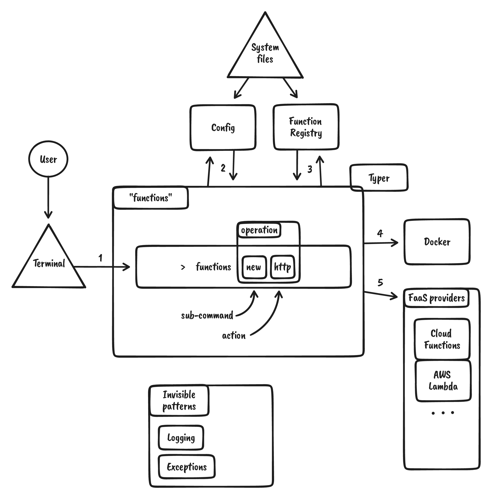

# `functions` - architecture overview

* Status: Proposed
* Deciders: [Piotr]
* Date: 2022-02-23

## Context and Problem Statement

This document describes all the architectural components used in the layout of the app.

It describe the assumed flow of the app under certain user stories and how different components fall into a full composition.

The architecture of the project has been developed in iterative process of improvement to the base concept (ADR-0001) and this document will formalize the decisions and provide shape and form context.

## Users

We are taking into the account following user stories:

* user has never worked with function as a service
* user has existing functions and wants to use the tool for unification and easy of use
  * locally on the machine of work
  * remotely in a form of a repository
* machine use, as an example being part of a CI/CD

## Goals

### Seamless installation

**Problem**: We want our users to have a single line and minimal complexity installation journey.

In the driver of *simplicity* the installation should be a quick and easy process. This should include all the ways of managing functions.

### Hight modularity

**Problem**: We want to allow user to decide which parts of the package are required and which one's are not.

This means that if the user only needs the local setup, then installing `docker` should be the only thing required to run those commands.

Some of the questions we need to answer with the solution:

* How do we figure out which components are available?
* How do we store that information?
* How do we change that state?
* Do we remove or update that information?
* Do we run any validation? If so, then when? How often?

### Components sync

**Problem**: We need to have a consistent way of knowing what is happening with various parts of the application at the lowest operational cost.

This means we want to know which functions are currently deployed, but we don't want to run a check every time a script is run, because that is very inefficient in the CLI way.

Some of the questions we need to answer with the solution:

* How and when do we query and store the current state of the `Docker` component? Is a function running, stopped, built?

### Assumptions

Our users are technically skilled individuals or organisation that have necessary skills to operate a CLI tool.

### Constraints

No constrains at the moment.

## Decision Drivers

* Implementation complexity
* Simplicity of use
* Configurability

## Design decision

The architecture is build in a iterative process with improving current design.

In the following sections we describe components, their purpose and how they may interact with other parts of the design.

### Overview

TBU

### App Diagram

*Insert a diagram representing different interactions between components.*

### Flow

TBU

Example interaction for basic case of CLI command.

1. User types a `functions` command in the terminal.
2. `functions` will evaluate available components and store this information in the config file. Command will raise exceptions if required components like `docker` are not present.
3. Next, it will evaluate the registry if information about this function is available and if said registry needs to be updated.
4. Depending on the command type, `docker` will be used to run or serve a targeted function.
5. If a command deploys resources to a cloud provider, we will use the correct provider to manipulate resources. Subject to authorization and sub-tool (like `gcloud`) availability.

TBU

- Internal state saved in a function registry
  - Config read order
  -
- Component management
- Functions Config
- Logging
- Exceptions
- Managing Docker resources
- Managing GCP resources
- Creating new resources
- Adding existing resources to the scope of the tool
  - defaults
  -
- Command validation and autocomplete
- Flows and Actions

### Disclaimer

All these sections describe an idea components. What is real and present in the code often escapes that. These are the best ideas that we came up with trying to handle code scalability, tool's functionality while maintaining an experimental mindset.

## Decision Impact

| Interested Parties/Groups | Informed |
| ------------------------- | -------- |
| All Users                 | N/A      |

### How will this decision be communicated to the public

There is no need to communicate it to any channels as it is a documentation written prior to any releases. It is bound to the first release.

## Links

* [ADR-0001](0001_initial_setup.md)

<!-- Identifiers, in alphabetical order -->

[Piotr]: https://github.com/Katolus
