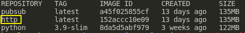

# How do we invoke a function?

* Status: Proposed
* Deciders: [Piotr]
* Date: 2021-02-26

## Context

We want to define and document what is the process of managing function resources like `docker` containers or GCP resources. How do we call and reference any of these resources?

## Problem

In order to use a docker image and spin a container, we have to have a way of "tagging" the built image. This comes with additional difficulties of using `names vs ids`, `ensuring uniqueness` or `enforcing syntax`.

## Criteria

We want to make sure that:

* it is a easy and intuitive for a user to invoke a function
* the results won't produce any unwanted outcomes

## Backfilled decision

This is one of the solutions that were defined prior to making any decisions and were never properly evaluated. It lead to a default implementation of a simple most of intuitive solution of using the function names to manage them.

## Implementation

We use function names as `unique` indicators for filter to a given resource.

Function names are defined on creation or add of a function to the registry. This cannot be changed without updating the configuration file.

A function that was added with a `http` name will invoked with same name.

```console
functions run http
```

The same name will be used to tag resources in components like `docker` or `GCP`.



## Future work

Since the initial implementation we discovered potential problems with solutions. We list here problems which we would want to tackle in the future.

### Define names, but use IDs

Instead of using names as a single source of truth we might want to use `id` a filter and uniqueness indicator but invocate the functions via a name. The main problem with this solution is invocation context. On `functions run http` will face an issue if there is another function with the same name.


<!-- Identifiers, in alphabetical order -->

[Piotr]: https://github.com/Katolus
