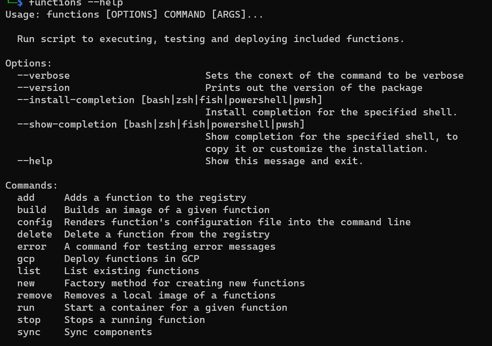

# Initial `functions-cli` setup

This document talks briefly about how the project was structured prior to making structured decisions and [documentations records](../adrs).

`functions-cli` was initial built on top of the `typer` library to easily support CLI components.

Repository had a a single subfolder (`commands`) initially that stored scripts specific to each subcommand. Later on a few other folders were added:

- `config` - stored logic around the configuration of the package. That would include the `ventress-functions` folder where all package specific information would be stored. It would also include the logic on how to open and validate these files.
- `docker` - stored logic around managing `docker` component throughout the app. A wrapper of the `docker-py` library with a few addition an interface prepared for making more changes.
- `gcp` - stored logic for interfacing with a

Every other piece of logic was small enough to be kept as a single script at the root of the main `functions` folder.

The code wasn't necessarily clearly contained within a container like the `config` folder. Some of the code would be incorrectly stored into single scripts. There wasn't a clear enough separation of interest, which often lead to refactoring and therefore triggered an attempt of planning and structuring code prior to making any commits.

Here is a view from the command line at this time.

