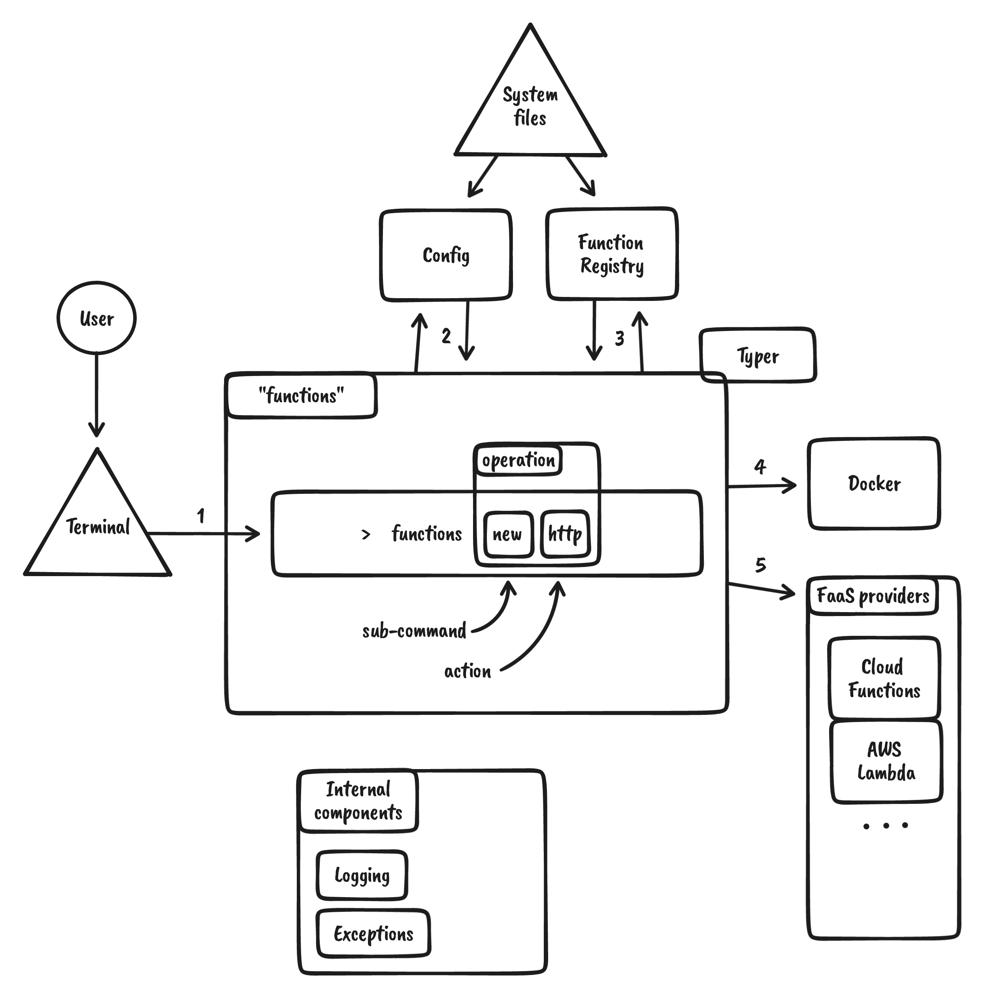

As it is with many projects, sometimes you barely have any idea how your tools work. Ha! Not here! We want to give you an opportunity to understand how things work behind the scenes.

Knowing this is not required to use `functions`, but if you are a born Curiosateles, check it out.

## So how does `functions` work?

We will look here in a high level overview of how this tool structured. How different components interact. What happens when you type a `functions` command and which components are triggered.

## Layout

Here lays a high-level layout of how our tool is built and how various components interact.

<!-- TODO: Would be fun to use one of the mkdocs blocks.  -->
Following assumes that `functions` is installed and available in the terminal.

1. User types a `functions` command in the terminal.
2. `functions` will evaluate available components and store this information in the config file. Command will raise exceptions if required components like `docker` are not present.
3. Next, it will evaluate the registry if information about this function is available and if said registry needs to be updated.
4. Depending on the command type, `docker` will be used to run or serve a targeted function.
5. If a command deploys resources to a cloud provider, we will use the correct provider to manipulate resources. Subject to authorization and sub-tool (like `gcloud`) availability.

<!-- For a more detailed view, checkout this Miro board -> [here](https://miro.com/app/board/uXjVOLC4avU=/?invite_link_id=128093571470). -->

## Internal components

### Typer core

Our tool is built on top a well known `typer` CLI tool.

### Config

Custom component responsible for saving `functions` configuration information on the file system.

### Functions Registry

Custom component responsible for saving information about each added, build, run, stopped and deployed "function". Information stored on the file system.

## External components

### Docker

All that makes `functions` fun, easy and functional is power by `docker`. We use it manage your functions locally and more.

### FaaS providers

- **Google Cloud Platform (GCP)** - We use `cloud functions` as a proof of concept for creating FaaS resources in the cloud.
- More to come...

## Invisible patterns

- `Exceptions` - A set of methods, wrappers and custom error classes built to handle exceptions from different parts of the tool in a unified way.
- `Logging` - `functions` can manipulate cloud and local resources therefore a `logging` functionality was developed to offer the bare minimum of viewing operation outcomes.
